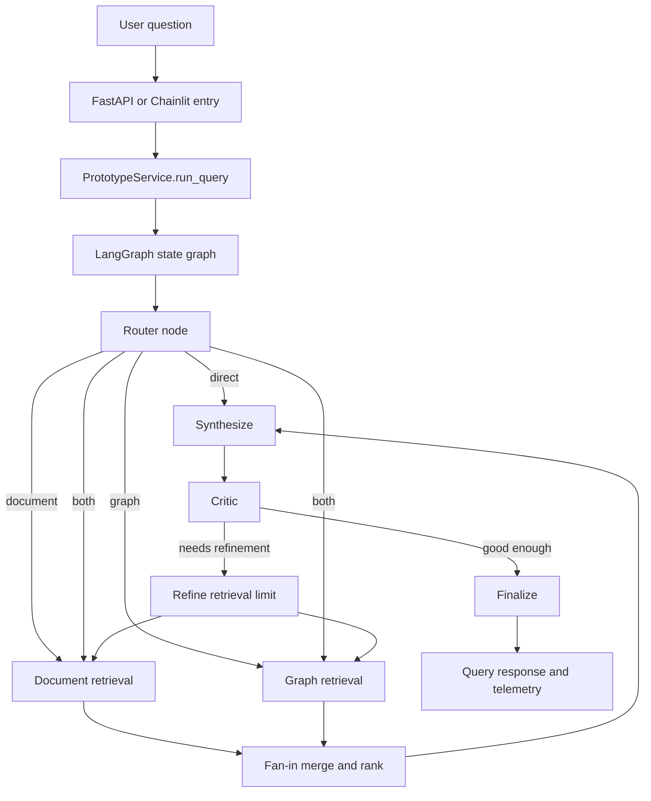
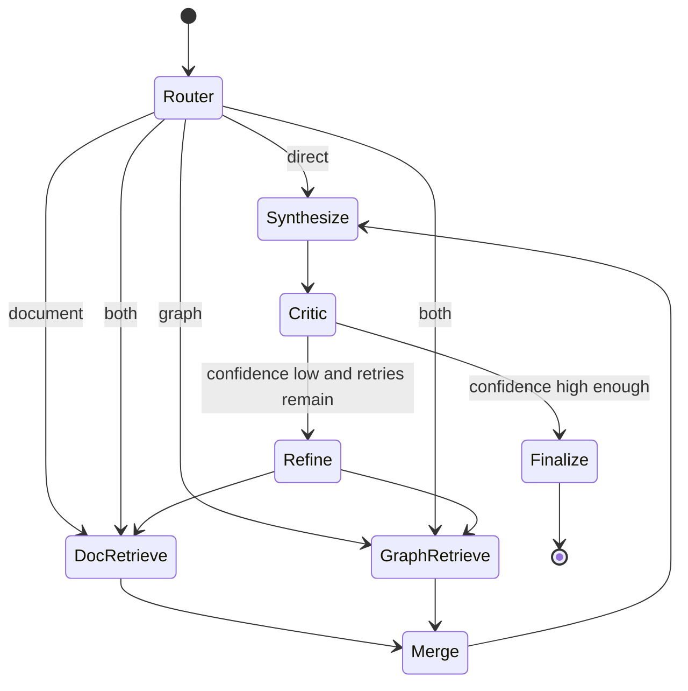

# Agentic Graph RAG in This Repository

Created at: 2/20/26 3:45PM

This document explains how Agentic Graph RAG works in this codebase and how the main runtime path is implemented.

## What "Agentic Graph RAG" means here

In this repo, "agentic" means a graph-orchestrated workflow where specialized steps (router, retrievers, merge, synthesis, critic, refinement) make bounded decisions and pass typed state forward.

"Graph RAG" has two meanings in practice:

1. **Graph-structured retrieval in Neo4j** (the default reliable production path today).
2. **`neo4j-graphrag` hybrid retrievers** (`HybridRetriever` / `HybridCypherRetriever`) behind config flags, with guarded fallback to Cypher.

So, the live system is best described as **Agentic Hybrid RAG** (document + graph), with **GraphRAG package adoption optional and gated**.

## High-level architecture

## Request lifecycle

1. API receives `POST /api/prototype/query` in `main.py`.
2. Runtime Gemini key override is applied from `X-Gemini-Api-Key` (if present).
3. `PrototypeService` builds initial orchestration state (`request_id`, query, retrieval limits).
4. LangGraph executes route -> retrieve -> merge -> synthesize -> critic -> (optional refine loop) -> finalize.
5. `QueryResponse` is returned with:
   - `route` (`direct`, `document`, `graph`, `both`)
   - `answer`
   - `snippets` (source-grounded evidence)
6. Structured orchestration telemetry is emitted from final state events.

## LangGraph implementation details

Core files:

- `lattice/prototype/orchestration/graph.py`
- `lattice/prototype/orchestration/state.py`
- `lattice/prototype/orchestration/nodes.py`
- `lattice/prototype/orchestration/critic.py`
- `lattice/prototype/orchestration/telemetry.py`

State is a typed dict (`OrchestrationState`) and uses reducer-safe list fields:

- `telemetry_events: Annotated[list[dict[str, Any]], operator.add]`
- `errors: Annotated[list[str], operator.add]`

That design allows safe fan-out/fan-in accumulation when multiple branches write concurrently.

## Routing behavior

Router implementation: `lattice/prototype/router_agent.py`

Heuristic cue sets determine route:

- Greetings -> `direct`
- Document hints (`pdf`, `document`, `timeline`, etc.) -> `document`
- Graph hints (`dependency`, `relationship`, `owner`, etc.) -> `graph`
- Mixed intent / compare cues with both signals -> `both`
- Ambiguous fallback -> `both` (prototype bias toward retrieval)

## Retriever bank (fan-out)

### Document retriever path

File: `lattice/prototype/retrievers/document_retriever.py`

- `SupabaseDocumentRetriever` (real mode): token-filtered candidate scan + overlap ranking.
- `SeedDocumentRetriever` (seeded mode): local JSON fallback from prototype data.

### Graph retriever path

File: `lattice/prototype/retrievers/graph_retriever.py`

- `Neo4jGraphRetriever` (default stable): Cypher-driven retrieval and ranking.
- `Neo4jGraphRagRetriever` (optional): wraps `neo4j_graphrag` hybrid retrievers.
- `SeedGraphRetriever` (fallback): local JSON graph edges.

### Fallback semantics

In branch nodes (`make_document_retrieval_node`, `make_graph_retrieval_node`):

- Primary success -> `retriever_mode="real"`
- Primary failure + seeded fallback enabled -> `retriever_mode="seeded_fallback"`
- Failure + fallback disabled -> synthetic system snippet (`retrieval_error:*`)

## Fan-in merge and ranking

File: `lattice/prototype/retrievers/merge.py`

- Combines document + graph snippets.
- Drops low relevance based on dynamic threshold:
  - `min_score = max(0.12, top_score * 0.4)`
- Deduplicates by `source_type:source_id`.
- Caps to top `max_results` (default 5).

## Synthesis and grounding

File: `lattice/prototype/synthesizer.py`

- If Gemini key exists and snippets exist: attempts Gemini generation.
- Otherwise: uses deterministic fallback synthesis.
- Output grounding guard appends citations if missing (`Sources: ...`).

## Critic and refinement loop

Files:

- `lattice/prototype/orchestration/critic.py`
- `lattice/prototype/orchestration/nodes.py` (`make_critic_node`, `make_refinement_node`, `make_finalize_node`)

Critic scores confidence from:

- snippet count vs minimum
- average snippet score
- source diversity (for `both` mode)
- citation signal in answer

If below threshold and retries remain:

- triggers refinement
- increments `refinement_attempt`
- increases `retrieval_limit`
- reruns retrieval branches

Finalize then applies a quality policy:

- high confidence -> normal answer
- medium confidence -> confidence note appended
- low confidence -> safe, cautionary response with source listing

## Config flags that control behavior

Config source: `lattice/prototype/config.py`

Important toggles:

- `USE_REAL_SUPABASE`
- `USE_REAL_NEO4J`
- `ALLOW_SEEDED_FALLBACK`
- `USE_NEO4J_GRAPHRAG_HYBRID`
- `NEO4J_GRAPHRAG_RETRIEVER_MODE` (`hybrid` or `hybrid_cypher`)
- `NEO4J_GRAPHRAG_VECTOR_INDEX`
- `NEO4J_GRAPHRAG_FULLTEXT_INDEX`
- `NEO4J_GRAPHRAG_EMBEDDER_PROVIDER` (`google` default, optional `openai`)

Phase 4 quality loop settings:

- `PHASE4_ENABLE_CRITIC`
- `PHASE4_CONFIDENCE_THRESHOLD`
- `PHASE4_MIN_SNIPPETS`
- `PHASE4_MAX_REFINEMENT_ROUNDS`
- `PHASE4_INITIAL_RETRIEVAL_LIMIT`
- `PHASE4_REFINEMENT_RETRIEVAL_LIMIT`

## Current GraphRAG package status in repo

From implementation and docs:

- `neo4j-graphrag` support is integrated but guarded.
- If prerequisites are missing (indexes, embedder, mode query, classes), service falls back to Cypher retriever.
- Preflight and regression scripts exist to verify if GraphRAG actually became active:
  - `scripts/regression/graphrag_preflight.py`
  - `scripts/regression/compare_graphrag_retrievers.py`

## Where to read next

- Runtime entrypoints: `main.py`, `lattice/chainlit_app.py`
- Service facade: `lattice/prototype/service.py`
- Orchestration graph: `lattice/prototype/orchestration/graph.py`
- Branch and critic logic: `lattice/prototype/orchestration/nodes.py`
- Regression coverage: `tests/test_orchestration_graph.py`, `tests/test_prototype_service.py`
